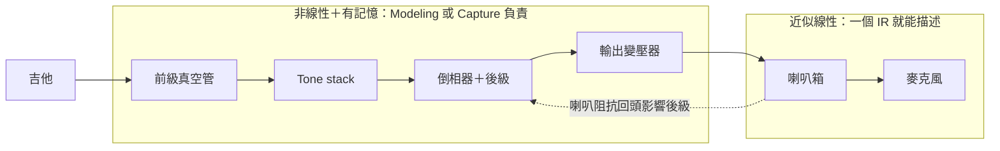
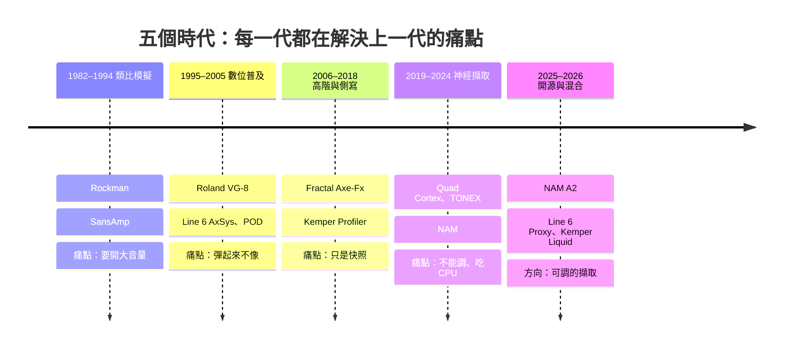
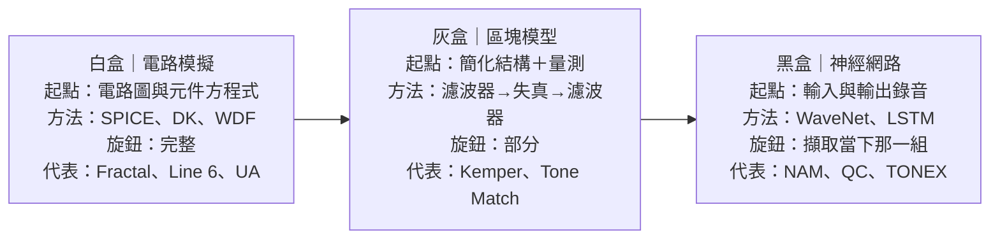
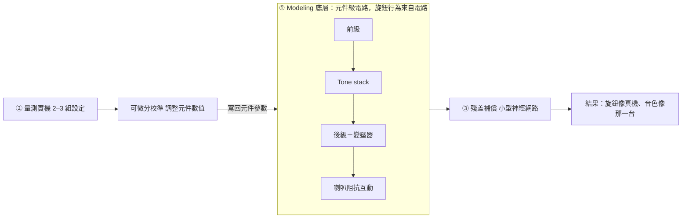

# 圖表說明（diagrams/）

PNG 是 Claude Docs 文件中互動圖的截圖（可直接放進簡報、show notes）。下方附 Mermaid 原始碼，任何支援 Mermaid 的編輯器（Obsidian、GitHub、VS Code 外掛、mermaid.live）都能重新繪製與修改。

| 檔案 | 用在節目哪一段 | 重點 |
| --- | --- | --- |
| 01_signal_chain.png | 第 2–3 段 | 音箱本體非線性、喇叭箱＋麥克風近似線性；IR 只負責後段 |
| 02_five_eras.png | 第 1、4 段 | 五個時代，每一代解決上一代的痛點 |
| 03_three_approaches.png | 第 5–7 段 | 白盒／灰盒／黑盒三條路 |
| 04_nam_workflow.png | 第 8–9 段 | NAM 擷取、訓練、播放流程 |
| 05_hybrid_architecture.png | 第 11 段 | Modeling 為底、Profiling 修正的架構草圖 |

## 01 訊號鏈



## 02 五個時代



## 03 三條路



## 04 NAM 流程

```mermaid
flowchart LR
  subgraph 擷取與訓練（做一次）
    S1[① 測試訊號 input.wav 約 3 分鐘] --> S2[② Reamp 進真音箱] --> S3[③ 錄下等長輸出 24-bit 48 kHz] --> S4[④ 訓練 約 10 分鐘 TONE3000／Colab／本機]
  end
  S4 == .nam 模型檔（A2：Full＋Lite 同一檔） ==> P2
  subgraph 播放（每次彈奏）
    P1[你的吉他 DI，輸入校準] --> P2[NAM 播放器 外掛／踏板] --> P3[喇叭箱 IR（amp-only 時）] --> P4[你聽到的音色]
  end
```

## 05 混合架構


